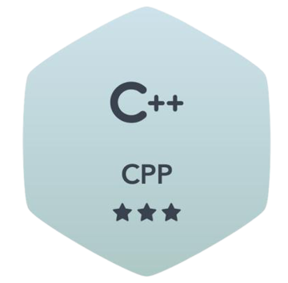

<h1 align="center">Hi , I'm Harsh Kulkarni</h1>
<h3 align="center">I am passionate about pursuing my major in Information Technology and Computer Science.</h3>

 

 
 

<b>Note:</b> Top languages is only a metric of the languages my public code consists of and doesn't reflect experience or skill level.

 
 

## 🙋‍♂️ About Me

- 👨🏻‍💻 I’m a student at the **Vishwakarma Institute of Technology Pune**.

- ✅I'm persuing *B.Tech Degree* with a major in **Computer Science**

- 🌱 I’m currently learning **Data Structures and Algorithms.**

- 👯 I’m looking to collaborate on **OpenSource Projects**

- 📫 How to reach me **harshkulkarni1705@gmail.com**

 

##  Programming Languages:

 
    
    
    
    
    

##  Tools:

    
    
    
    
    

<!--       -->
 

##  Badges

 

 
 

## Connect with me:

## ❤ Views and Followers

